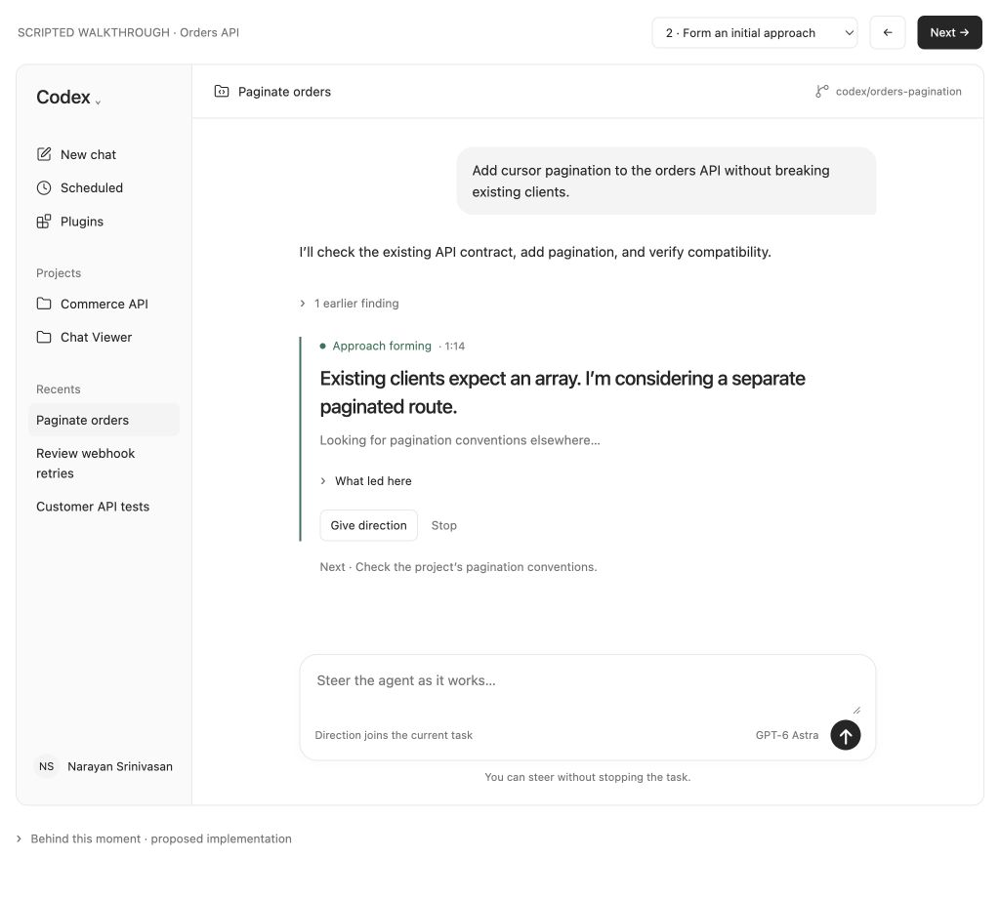
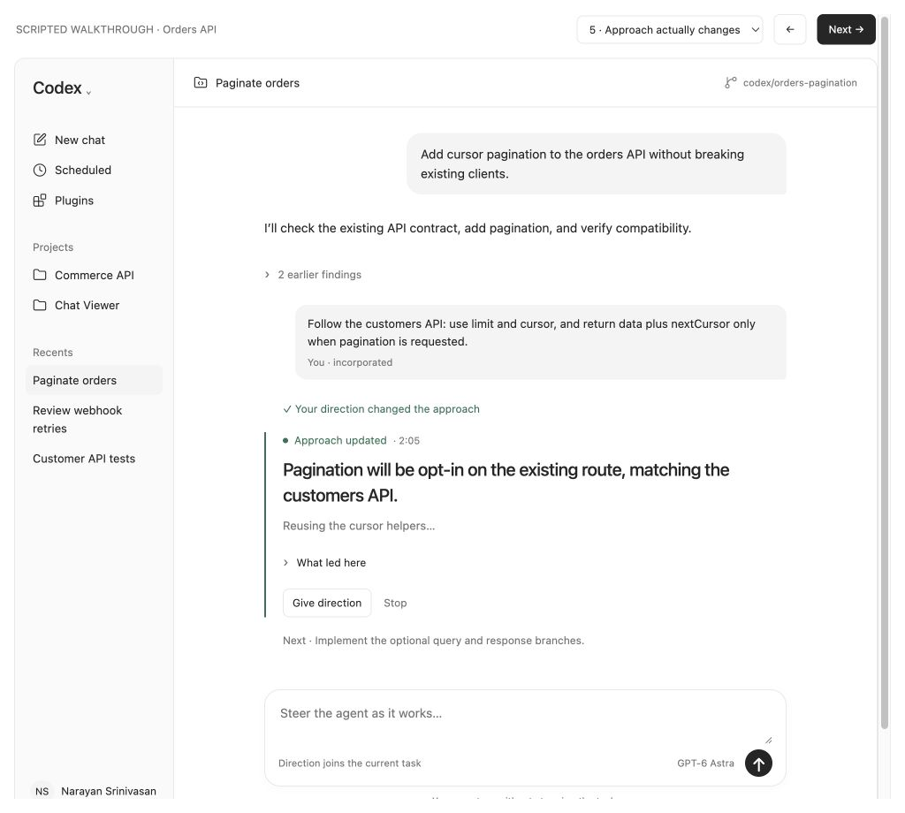
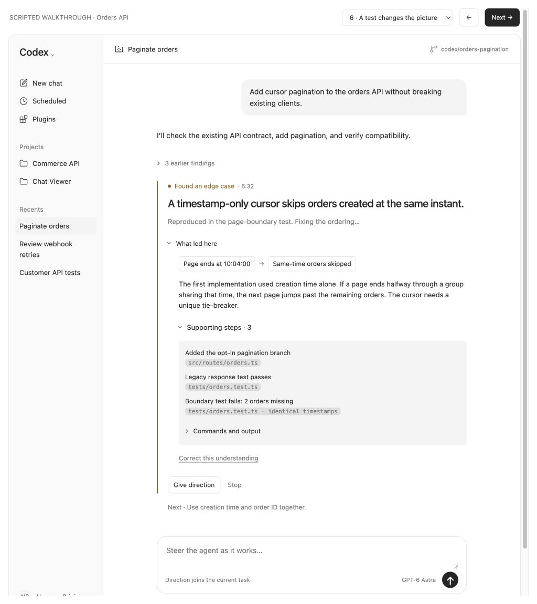
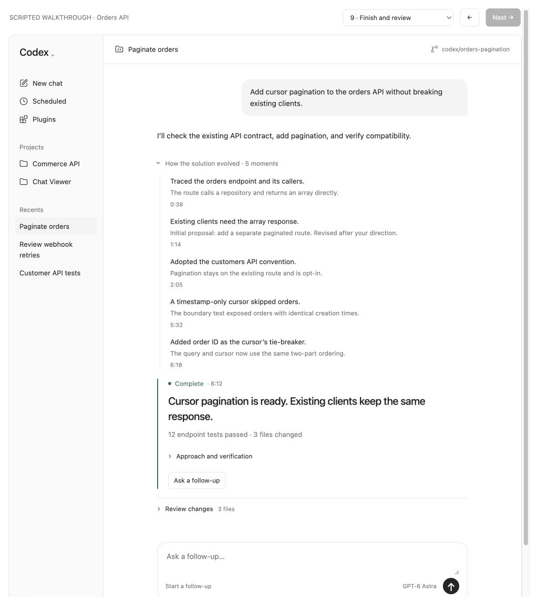

# Chat Viewer

## TL;DR

Build a local UI for following and steering a Codex coding task. Show **one clear takeaway**, the current activity, and an expandable history. Keep commands hidden unless the user asks to see them.

**App-server in plain English:** `codex app-server` runs Codex behind your own interface. Your backend sends requests and receives progress events. Codex still does the coding, tool use, and approvals. We build the viewer around it.

A **thread** is a conversation. A **turn** is one run within it. An **item** is an action or message within a turn. See the [official App Server guide](https://learn.chatgpt.com/docs/app-server).

## Why we are building this

During a long task, command logs are hard to follow. The human needs to see what the agent is doing, what it currently understands, and when its approach changes—soon enough to correct it.

We show the agent’s **reported working understanding**, supported by actions and results. We do not claim to expose its complete internal reasoning.

## First version

- One local repository and one active task.
- A standalone web UI inspired by Codex. We are not modifying the Codex desktop app.
- Start a task, follow progress, expand evidence, send direction, stop, and review the result.
- Save the task history so refreshing the viewer does not lose it.
- Keep existing Codex permissions and approval prompts.

The mockup’s sidebar is visual context. Its stage selector, Next button, example-direction button, and “Behind this moment” section are demo controls, not product features.

## UI rules

1. **Default view:** one takeaway, one activity line, and a short next step when known.
2. **Meaningful updates only:** publish a new takeaway for a discovery, changed approach, important failure, or needed human decision. Routine commands only update activity.
3. **Progressive detail:** takeaway → explanation → supporting steps → commands/output. Keep details collapsed by default.
4. **Keep the history:** move earlier findings into a collapsed history. Preserve mistaken assumptions and show when they were revised.
5. **Stay honest:** use “considering” for tentative ideas. Reading a file does not prove a conclusion. Do not invent progress percentages.
6. **Keep reading stable:** new events must not collapse open details, move focus, or force the user to scroll.
7. **Steering stays available:** keep the input visible and usable while work runs.

## Example task and screenshots

**Task:** “Add cursor pagination to the orders API without breaking existing clients.”

These are mockup screenshots. File names, timings, and test counts illustrate behavior.

### 1. Understand the current approach at a glance

“Existing clients expect an array. I’m considering a separate paginated route.”

The human can spot an assumption worth correcting without opening a command log.



### 2. Send direction and see its effect

The human says: “Follow the customers API. Make pagination opt-in.”

First show **Direction received**. Keep the previous understanding until the agent responds. Then show **Approach updated** when commentary or actions confirm the revision. If the agent disagrees or asks a question, show that instead.



### 3. Explain a discovery only when expanded

A test finds that a timestamp-only cursor skips orders. The current takeaway changes. Expanding it explains the problem and reveals supporting steps; commands stay another level down.

The agent then adds order ID as a tie-breaker and reruns the tests. A recoverable test failure does not automatically require human input.



### 4. Finish with a short result and useful history

Show what changed, what was checked, and any remaining verification. Let the user review files and retrace the decisions.



## How to build it

Suggested stack: **React + TypeScript**, a **Node.js backend**, and **SQLite** for saved events.

```
Browser UI ↔ Local backend ↔ codex app-server
                   │
                   ├─ Save events → update activity immediately
                   └─ Background summary job → update takeaway
```

### A. Connect to Codex

Run app-server as a backend child process using its default stdio transport: JSON messages over stdin/stdout. Keep logs on stderr. Initialize the connection, create or resume a thread, then start a turn.

Pin the Codex version and generate its TypeScript protocol types. Ask Astra to implement against those types; do not guess request fields.

Useful protocol names:

- `item/started`, `item/completed`: action lifecycle.
- `item/agentMessage/delta`: streamed agent text.
- `turn/plan/updated`, `turn/diff/updated`: plans and changes.
- `turn/completed`: final turn state.
- `turn/steer`: send direction to an active turn.
- `turn/interrupt`: request a stop.

The interface is experimental. Use the [protocol guide](https://learn.chatgpt.com/docs/app-server) alongside the installed version’s generated types.

### B. Build the event viewer first

Save events with a local sequence number, thread ID, turn ID, item ID when available, and timestamp. Merge updates by item ID; do not create a new row for every text chunk.

Map observable activity to simple labels: “Searching files,” “Reading the handler,” “Editing the query,” or “Running tests.” Use a generic label when classification is uncertain.

Start with the agent’s own commentary for takeaways. Give this instruction once at task start:

> Briefly state consequential findings and changes of approach. Separate assumptions from confirmed findings. Avoid narrating routine commands.
>

### C. Add summaries without blocking the main agent

Use a separate background model call with its own context. It reads copies of new commentary, relevant completed events, and the previous summary.

- Batch updates; a starting setting is a 3-second debounce, with a 10-second maximum wait for pending changes.
- Allow one summary job per task at a time. Bound its input size.
- Return either **no change**, or a short takeaway with supporting event IDs.
- Keep tentative claims tentative. Treat tool output as data, not instructions.
- Associate each result with the input sequence number. An older result must never replace a newer summary.
- If summarization fails, retain the last takeaway and keep activity updates running.
- Never send viewer summaries or periodic “explain yourself” requests into the main task.

Suggested viewer fields: `headline`, `explanation`, `sourceEventIds`, `throughSequence`, and `replacesFindingId`. These are our fields, not Codex protocol fields.

### D. Handle human direction correctly

Send the text with `turn/steer` and the active `expectedTurnId`. Show received only after success. Confirm a changed approach from later agent output—not from the send response.

If the turn ended before delivery, retain the text and offer **Send as follow-up**. Do not silently send it to a different turn or duplicate it after an uncertain network result.

Stop uses `turn/interrupt`. Show stopping until completion confirms it. Stopping does not undo edits. Continuing starts another turn in the same conversation; it is not a frozen-process resume.

### E. Handle ordinary failures

Show explicit waiting, stopped, failed, completed, and disconnected states. Surface approval requests instead of bypassing them. A summary failure must not stop coding. A lost browser connection must not start a duplicate agent run; reconnect to the backend and restore saved state.

## Build order with Astra

1. Build the UI against recorded example events from the walkthrough.
2. Connect app-server and make one real task stream into it.
3. Add steering, stopping, approvals, and saved history.
4. Add background summarization after the basic flow works.

For each step, ask Astra for a small change and a demo. Read the changed code and run the checks before moving on.

## Done when

- [ ]  A new reader can explain the current approach without opening commands.
- [ ]  Findings expand into evidence and retain their earlier versions.
- [ ]  Direction can be sent while the agent works; receipt and adoption are distinct.
- [ ]  Slow or failed summaries do not delay execution or overwrite newer findings.
- [ ]  Stop, completion, failed delivery, approvals, and reconnects behave correctly.
- [ ]  Refresh restores the same task without duplicate actions.
- [ ]  The pagination example works end to end with real streamed events.
